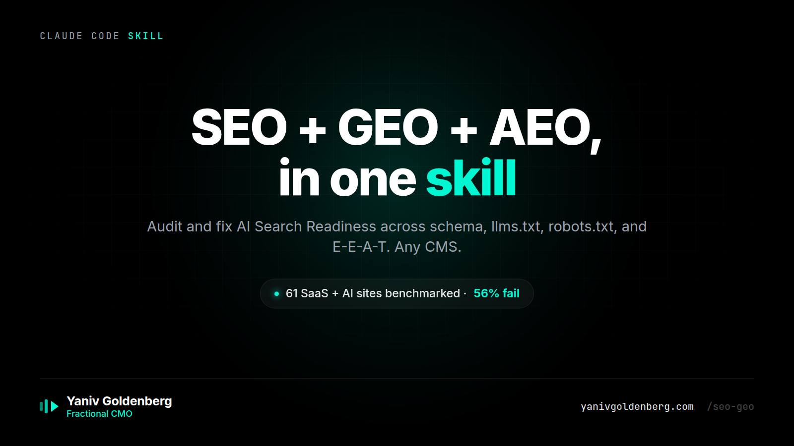
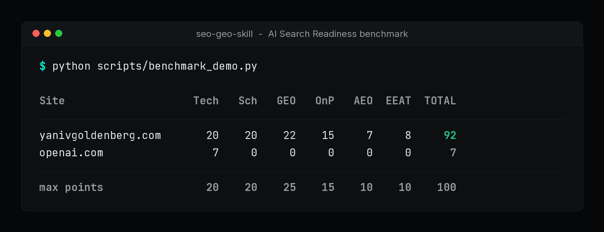
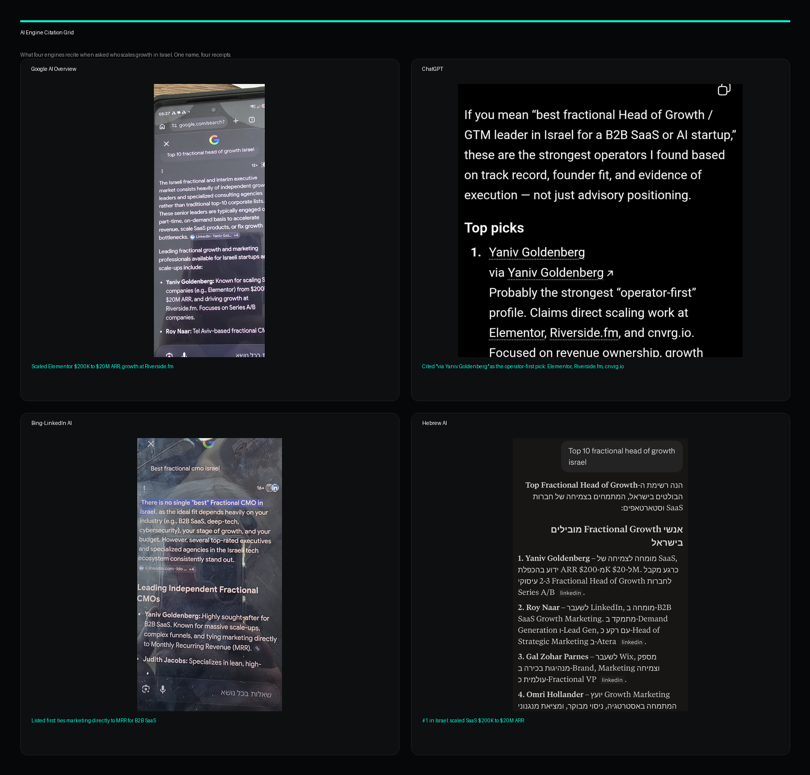

# seo-geo-skill

<p align="center">
  
</p>

<p align="center">
  
</p>

<p align="center"><sub>Real output. Reproduce it: <code>python scripts/benchmark_demo.py</code></sub></p>

<div align="center">

**A single-file Claude Code skill that audits and fixes AI Search Readiness across SEO, GEO, AEO, schema, llms.txt, robots.txt, and E-E-A-T.**

*Benchmarked on 61 SaaS and AI sites (re-scored 2026-06-23). 56% scored 60 or below. OpenAI and Perplexity score 7/100 each. Same 100-point rubric. Reproducible script. Safe by default.*

*See the full [State of AI Search Visibility 2026](docs/state-of-ai-search-2026.md) report.*

[](https://github.com/yanivgoldenberg/seo-geo-skill/releases)
[](https://github.com/yanivgoldenberg/seo-geo-skill/stargazers)
[](https://github.com/yanivgoldenberg/seo-geo-skill/actions)
[](docs/state-of-ai-search-2026.md)
[](LICENSE)
[](https://claude.ai/code)

</div>

---

## Run it on your site in 10 seconds

```bash
curl -fsSL https://raw.githubusercontent.com/yanivgoldenberg/seo-geo-skill/main/seo-geo.md \
  -o ~/.claude/skills/seo-geo.md

# then in Claude Code:
/seo-geo https://yoursite.com
```

One command. Full audit. Ranked fix list. Works on any CMS.

---

## We benchmarked 61 top SaaS and AI sites. 56% fail AI Search Readiness.

The two AI category leaders, OpenAI and Perplexity, score 7/100 each, the lowest on the board. Full leaderboard in [State of AI Search Visibility 2026](docs/state-of-ai-search-2026.md) (re-scored 2026-06-23).

The bottom of the 61-site leaderboard tells the story:

| Rank | Site | Score | Notable |
|---:|---|---:|---|
| 59 | **canva.com** | **13** | *No JSON-LD schema, no AI-crawler allow.* |
| 60 | **openai.com** | **7** | *ChatGPT's parent. Zero JSON-LD schema on homepage.* |
| 60 | **perplexity.ai** | **7** | *Same profile as OpenAI.* |

The AI category leaders score near zero on AI Search Readiness.

**[Full 61-site leaderboard + methodology](docs/state-of-ai-search-2026.md)** | **[OpenAI case study: 7 to 70 fix blueprint](docs/case-study-openai.md)**

### What the data shows

- **56% of 61 top SaaS and AI sites scored 60 or below.** Failing AI Search Readiness is still the norm.
- **Mean score: 54.3 / 100. Median: 59.** Most sites leave a third or more of rubric points on the table.
- **llms.txt is entity hygiene, not a ranking lever** - no major AI search engine consumes it as of 2026 (Google publicly declined it). The rubric weights it accordingly (3 of 25 GEO points); entity presence and citation-worthy content carry the GEO score.
- **44% still lack full Person + Organization schema on their homepage.**
- **OpenAI and Perplexity score 7/100 each.** The category leaders are almost invisible to their own category of search.

If your site scores below 60 on this rubric, you're in the bottom half of well-funded SaaS brands. The three highest-leverage wins:

1. Add Organization + Person JSON-LD with sameAs → +~14 points
2. sameAs with Wikidata + allow AI search crawlers (OAI-SearchBot, Perplexity-User) → +13 points
3. Publish `/llms.txt` + `/llms-full.txt` → +3 points (cheap hygiene)

This skill automates all three in one session.

---

## Original 13-site cohort (the first public benchmark)

Before the 61-site study, I scored a 13-site cohort and published it in [`docs/benchmarks.md`](docs/benchmarks.md). Different run, different rubric calibration (v1.6.0), so the scores here are not the same numbers as the 61-site study above. This is the original Top-13, reproduced here so the two documents always agree:

| Rank | Site | Score |
|---:|---|---:|
| 1 | yanivgoldenberg.com | 90 |
| 2 | stripe.com | 73 |
| 2 | resend.com | 73 |
| 4 | planetscale.com | 65 |
| 5 | vercel.com | 63 |
| 5 | figma.com | 63 |
| 7 | notion.so | 60 |
| 8 | mercury.com | 58 |
| 9 | supabase.com | 55 |
| 10 | linear.app | 53 |
| 11 | anthropic.com | 30 |
| 12 | ramp.com | 25 |
| 13 | fly.io | 10 |

Full per-dimension breakdown and methodology in [`docs/benchmarks.md`](docs/benchmarks.md).

---

## What Google actually says (and what this score is)

I am not going to sell you a guarantee. Google has publicly stated that no special file is required to appear in AI Overviews, and there is no documented ranking signal called "llms.txt." So this is the honest framing:

- **The score is AI Search Readiness: machine-legibility, not a ranking promise.** It measures how cleanly a machine (a crawler, an LLM, an answer engine) can parse your entity, your schema, and your stated facts. It does not predict your position.
- **Citations and rankings are the outcome, not the deliverable.** I make your site easier to read and trust. Whether ChatGPT, Claude, Perplexity, or Google AI Overviews then cite you depends on their systems, your authority, and your content. I do not control those, and anyone who says they guarantee a #1 result is selling you something I will not.
- **The evidence is correlation, stated as correlation.** Across the 61-site benchmark, the sites that publish `/llms.txt` consistently pair with the strongest GEO scores. That is a pattern in the data, not a causal lever I am promising.

What I will stand behind: the score is reproducible. Run `tests/benchmark_sites.py` against any URL and you get the same number I do. No claim in this repo lacks a number or a named site behind it.

<p align="center">
  
</p>

---

## Who this is for

- Marketers who want citations in ChatGPT, Perplexity, and Google AI Overviews
- Developers adding SEO to a client site and need it done right the first time
- Agencies running the same 20-phase audit on 50+ client sites per year

**Not a fit** if you want a 20-sub-skill toolbox. See [`docs/compare.md`](docs/compare.md) for honest comparisons to other Claude Code SEO skills.

---

## What it does (Phase 0 audit + 20 optimization phases)

Open `seo-geo.md` for the full skill. At a glance:

**The audit** (Phase 0, non-destructive, always safe):
- 100-point rubric across 6 dimensions: Technical 20 + On-Page 15 + Schema 20 + GEO 25 + AEO 10 + E-E-A-T 10
- Same six buckets and 100-pt scale as the automated benchmark (`tests/benchmark_sites.py`); the benchmark scores the crawl-observable subset (see [SCORING.md](docs/SCORING.md))
- Phases 1-3 - Technical SEO, on-page, schema (18 types)
- Phase 4 - LLM citation (llms.txt + entity anchoring)
- Phase 5 - Answer engine optimization
- Phase 6 - E-E-A-T trust signals
- Phases 7-14 - Content, speed, hreflang, debugging

**The writes** (opt-in via `--apply`):
- Phase 15 - WordPress security hardening
- Phase 16 - Field patterns from production
- Phase 17 - Dry-run safety gates + banned endpoint list
- Phase 18 - Multi-platform adapters (WordPress / Shopify / Webflow / Next.js)
- Phase 19 - Competitor benchmarking
- Phase 20 - LLM Extractability Polish (LLM Summary, claims table, cite block, glossary, raw-data download, self-consistency check)

---

## Install

```bash
# Global install
curl -fsSL https://raw.githubusercontent.com/yanivgoldenberg/seo-geo-skill/main/seo-geo.md \
  -o ~/.claude/skills/seo-geo.md
```

<details>
<summary>Project-level install + plugin use</summary>

```bash
# Project-level only
curl -fsSL https://raw.githubusercontent.com/yanivgoldenberg/seo-geo-skill/main/seo-geo.md \
  -o .claude/skills/seo-geo.md
```
</details>

---

## Usage

```bash
# Start here
/seo-geo https://yoursite.com

# Variants
/seo-geo --verify                # self-test: tools accessible?
/seo-geo --audit-only            # score only, no writes
/seo-geo --phase geo             # LLM citation only (fastest ROI)
/seo-geo --phase technical       # technical SEO only
/seo-geo --page <url>            # single page audit
/seo-geo --apply                 # writes enabled (opt-in, see Phase 17)
/seo-geo --benchmark <competitor> # head-to-head score
```

---

## Seen at / Running in production

- **yanivgoldenberg.com** - canonical reference deployment. **92/100, rank 1 of 61** on the re-scored 2026-06-23 leaderboard (down from 97 after llms.txt was de-weighted; the GEO points moved to entity presence and citation content, which the site already wins). The monthly Action commits every fresh snapshot to [docs/state-of-ai-search-history/](docs/state-of-ai-search-history/). Run it yourself and you get today's number. ([proof](docs/state-of-ai-search-2026.md))
- Used to generate the **[State of AI Search Visibility 2026](docs/state-of-ai-search-2026.md)** benchmark (61 SaaS and AI sites, 56% fail). [Read the live report.](https://yanivgoldenberg.com/state-of-ai-search-visibility-2026/)
- Public benchmark methodology: `tests/benchmark_sites.py` - runnable and reproducible by anyone.

---

## Schemas supported

`Person` `Organization` `SoftwareApplication` `LocalBusiness` `Product` `Service` `Article` `BlogPosting` `FAQPage` `HowTo` `BreadcrumbList` `WebSite` `ProfilePage` `DefinedTerm` `Review` `SpeakableSpecification` `VideoObject` `ItemList`

---

## Author

**[Yaniv Goldenberg](https://yanivgoldenberg.com)** | [The skill, hosted](https://yanivgoldenberg.com/ai-search-readiness/) | [LinkedIn](https://www.linkedin.com/in/yanivgoldenberg/)

Fractional Head of Growth. Scaled a PLG SaaS to 20M+ users (100x ARR), tripled MRR at a consumer SaaS (+337%), grew an MLOps SaaS acquired by a Fortune 100. $100M+ in ad spend managed. I help post-PMF SaaS and e-commerce brands dominate AI search results - so ChatGPT, Claude, and Perplexity cite you before your competitors.

If this saved you an afternoon, star the repo.

---

## Want this applied to your SaaS site?

I run a paid **AI Search Visibility Audit** for post-PMF SaaS, B2B, and e-commerce brands.

For post-PMF SaaS and e-commerce brands with organic demand but no technical citation layer. Not keyword research. Not link building. The layer that helps AI systems understand, trust, and cite your brand.

**You get:**
- 0-100 AI Search Readiness score across 6 dimensions (Technical 20 + On-Page 15 + Schema 20 + GEO 25 + AEO 10 + E-E-A-T 10)
- Head-to-head benchmark vs 3 competitors
- Top 10 fixes ranked by impact, effort, and implementation risk
- Schema, llms.txt, robots.txt, and entity-signal gap report
- Implementation plan your dev team can ship
- 30-minute walkthrough

**Price anchor:** Audit starts at **$7.5K**. Larger sites and multi-brand benchmarks are scoped separately. If you continue into the Implementation Sprint, the audit fee is credited in full.

**Format:** application-only. Post-PMF SaaS, B2B, and e-commerce brands.

**Sample output:** [`docs/sample-paid-audit.md`](docs/sample-paid-audit.md) - see exactly what a finished audit looks like before applying.

[**Apply for the AI Search Visibility Audit →**](https://yanivgoldenberg.com/contact/)

---

## License

[PolyForm Noncommercial 1.0.0](https://polyformproject.org/licenses/noncommercial/1.0.0)

You may run this on your own sites and internal company sites. Paid agency resale, white-labeling, SaaS packaging, or using it as a billable client deliverable requires a commercial license. For client-service use cases, contact me for permission or a commercial license.

| Use case | Allowed | License required |
|---|---|---|
| Run on your own site | Yes | No |
| Run on client sites as part of your service | Yes, with written permission | Contact for permission |
| Run inside your company for internal audits | Yes | No |
| Fork and modify for personal/internal use | Yes | No |
| Resell as a paid product or SaaS | No | Commercial license |
| White-label or package under your brand | No | Commercial license |
| Embed in a commercial tool you sell | No | Commercial license |

Commercial license: [yanivgoldenberg.com/contact](https://yanivgoldenberg.com/contact/)

---

## Suggested repo topics

If you fork or star this, these are the GitHub topics that make it findable for the AI-search crowd. Add them under the repo "About" gear:

```
claude-code  claude-skill  seo  geo  aeo  llms-txt  schema-org  ai-search
```

---

## Don't trust me. Run it.

This whole repo is falsifiable in two commands. First, score your own site in 10 seconds (the install is at the top of this README):

```bash
/seo-geo https://yoursite.com
```

Then score mine and check my claim:

```bash
/seo-geo https://yanivgoldenberg.com
```

I claim yanivgoldenberg.com scores 92/100, rank 1 of 61 on the re-scored 2026-06-23 leaderboard. The dated snapshots live in docs/state-of-ai-search-history/, committed by the monthly Action, not by me. Run it yourself and you get today's number. If your run disagrees, open an issue with the output and I will fix the skill or the claim. Every number in this repo is reproducible with `tests/benchmark_sites.py`, so there is nowhere for a bad number to hide.
