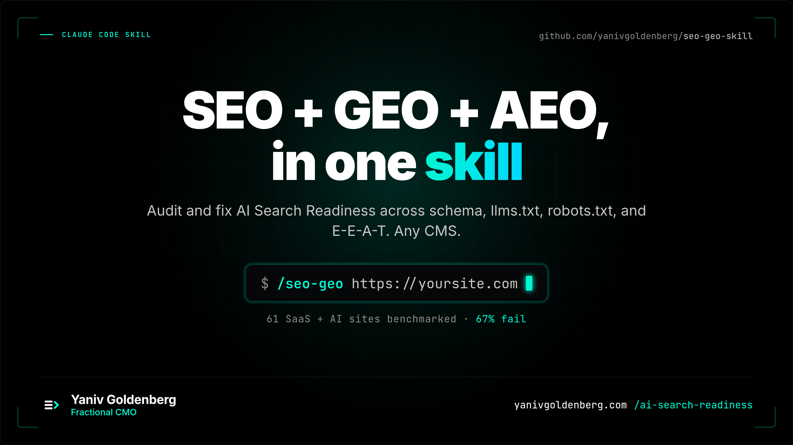

# seo-geo-skill

<p align="center">
  
</p>

<div align="center">

**A single-file Claude Code skill that audits and fixes AI Search Readiness across SEO, GEO, AEO, schema, llms.txt, robots.txt, and E-E-A-T.**

*Benchmarked on 61 SaaS and AI sites. 67% scored 60 or below. OpenAI and Perplexity score 7/100 each. Same 100-point rubric. Reproducible script. Safe by default.*

*See the full [State of AI Search Visibility 2026](docs/state-of-ai-search-2026.md) report.*

[](https://github.com/yanivgoldenberg/seo-geo-skill/releases)
[](https://github.com/yanivgoldenberg/seo-geo-skill/actions)
[](docs/state-of-ai-search-2026.md)
[](LICENSE)
[](https://claude.ai/code)

</div>

---

## Run it on your site in 10 seconds

```bash
curl -fsSL https://raw.githubusercontent.com/yanivgoldenberg/seo-geo-skill/main/seo-geo.md \
  -o ~/.claude/skills/seo-geo.md

# then in Claude Code:
/seo-geo https://yoursite.com
```

One command. Full audit. Ranked fix list. Works on any CMS.

---

## We benchmarked 61 top SaaS and AI sites. 67% fail AI Search Readiness.

Two AI category leaders, OpenAI and Perplexity, score 7/100 each. Railway scores 0. Full leaderboard in [State of AI Search Visibility 2026](docs/state-of-ai-search-2026.md).

Short public cohort (original 13, methodology baseline):

| Rank | Site | Score | Why |
|---:|---|---:|---|
| 1 | **yanivgoldenberg.com** | **90** | Full stack: llms.txt, Organization + Person schema, AI-crawler allow |
| 2 | stripe.com | 73 | No llms.txt |
| 2 | resend.com | 73 | No AI-crawler allow in robots |
| 4 | planetscale.com | 65 | No Person schema |
| 5 | vercel.com | 63 | Thin Organization schema |
| 5 | figma.com | 63 | No llms.txt |
| 7 | notion.so | 60 | No Organization schema on homepage |
| 8 | mercury.com | 58 | No llms.txt |
| 9 | supabase.com | 55 | No Organization schema |
| 10 | linear.app | 53 | No schema on homepage at all |
| 11 | **anthropic.com** | **30** | *The AI company itself: no llms.txt, no Organization schema* |
| 12 | ramp.com | 25 | Minimal homepage markup |
| 13 | fly.io | 10 | No robots.txt, no schema, no meta |

**Full methodology + reproduce-yourself script:** [`docs/benchmarks.md`](docs/benchmarks.md)

### What the data shows

- **53% of top SaaS sites have no llms.txt.** It is entity hygiene, not a guaranteed ranking lever - Google has stated no special file is required for AI Overviews. But the sites that publish it give AI crawlers a clean index of what to cite, and it consistently pairs with the strongest GEO scores.
- **73% have no proper Person or Organization schema on their homepage.**
- **Only 3 sites explicitly allow AI crawlers in robots.txt.** The rest rely on implicit allow, which security plugins often treat as deny.
- **Anthropic.com - the company building Claude - scores 30/100.** Even the AI companies are blind to AI.

If your site scores below 60 on this rubric, you're in the bottom third of well-funded SaaS brands. The three cheapest wins:

1. Publish `/llms.txt` and `/llms-full.txt` → +25 points
2. Add Organization + Person JSON-LD → +15 points
3. Allow AI crawlers explicitly in robots.txt → +10 points

This skill automates all three in one session.

---

## Who this is for

- Marketers who want citations in ChatGPT, Perplexity, and Google AI Overviews
- Developers adding SEO to a client site and need it done right the first time
- Agencies running the same 20-point audit on 50+ client sites per year

**Not a fit** if you want a 20-sub-skill toolbox. See [`docs/compare.md`](docs/compare.md) for honest comparisons to other Claude Code SEO skills.

---

## What it does (Phase 0 audit + 19 optimization phases)

Open `seo-geo.md` for the full skill. At a glance:

**The audit** (Phase 0, non-destructive, always safe):
- 100-point rubric across 6 dimensions: Technical 20 + On-Page 15 + Schema 20 + GEO 25 + AEO 10 + E-E-A-T 10
- Same rubric is used by `tests/benchmark_sites.py`; no methodology drift between docs and code
- Phases 1-3 - Technical SEO, on-page, schema (16 types)
- Phase 4 - LLM citation (llms.txt + entity anchoring)
- Phase 5 - Answer engine optimization
- Phase 6 - E-E-A-T trust signals
- Phases 7-14 - Content, speed, hreflang, debugging

**The writes** (opt-in via `--apply`):
- Phase 15 - WordPress security hardening
- Phase 16 - Field patterns from production
- Phase 17 - Dry-run safety gates + banned endpoint list
- Phase 18 - Multi-platform adapters (WordPress / Shopify / Webflow / Next.js)
- Phase 19 - Competitor benchmarking

---

## Install

```bash
# Global install
curl -fsSL https://raw.githubusercontent.com/yanivgoldenberg/seo-geo-skill/main/seo-geo.md \
  -o ~/.claude/skills/seo-geo.md
```

<details>
<summary>Project-level install + plugin use</summary>

```bash
# Project-level only
curl -fsSL https://raw.githubusercontent.com/yanivgoldenberg/seo-geo-skill/main/seo-geo.md \
  -o .claude/skills/seo-geo.md
```
</details>

---

## Usage

```bash
# Start here
/seo-geo https://yoursite.com

# Variants
/seo-geo --verify                # self-test: tools accessible?
/seo-geo --audit-only            # score only, no writes
/seo-geo --phase geo             # LLM citation only (fastest ROI)
/seo-geo --phase technical       # technical SEO only
/seo-geo --page <url>            # single page audit
/seo-geo --apply                 # writes enabled (opt-in, see Phase 17)
/seo-geo --benchmark <competitor> # head-to-head score
```

---

## Schemas supported

`Person` `Organization` `SoftwareApplication` `LocalBusiness` `Product` `Service` `Article` `BlogPosting` `FAQPage` `HowTo` `BreadcrumbList` `WebSite` `ProfilePage` `DefinedTerm` `Review` `SpeakableSpecification` `VideoObject`

---

## Author

**[Yaniv Goldenberg](https://yanivgoldenberg.com)** | [LinkedIn](https://www.linkedin.com/in/yanivgoldenberg/)

Fractional Head of Growth. Scaled a PLG SaaS to 20M+ users (100x ARR), tripled MRR at a consumer SaaS (+337%), grew an MLOps SaaS acquired by a Fortune 100. $100M+ in ad spend managed. I help post-PMF SaaS and e-commerce brands dominate AI search results - so ChatGPT, Claude, and Perplexity cite you before your competitors.

If this saved you an afternoon, star the repo.

---

## Want this applied to your SaaS site?

I run a paid **AI Search Visibility Audit** for post-PMF SaaS, B2B, and e-commerce brands.

For post-PMF SaaS and e-commerce brands with organic demand but no technical citation layer. Not keyword research. Not link building. The layer that helps AI systems understand, trust, and cite your brand.

**You get:**
- 0-100 AI Search Readiness score across 6 dimensions (Technical 20 + On-Page 15 + Schema 20 + GEO 25 + AEO 10 + E-E-A-T 10)
- Head-to-head benchmark vs 3 competitors
- Top 10 fixes ranked by impact, effort, and implementation risk
- Schema, llms.txt, robots.txt, and entity-signal gap report
- Implementation plan your dev team can ship
- 30-minute walkthrough

**Price anchor:** Audit starts at **$7.5K**. Larger sites and multi-brand benchmarks are scoped separately. If you continue into the Implementation Sprint, the audit fee is credited in full.

**Format:** application-only. Post-PMF SaaS, B2B, and e-commerce brands.

**Sample output:** [`docs/sample-paid-audit.md`](docs/sample-paid-audit.md) - see exactly what a finished audit looks like before applying.

[**Apply for the AI Search Visibility Audit →**](https://yanivgoldenberg.com/contact)

---

## License

[PolyForm Noncommercial 1.0.0](https://polyformproject.org/licenses/noncommercial/1.0.0)

You may run this on your own sites and internal company sites. Paid agency resale, white-labeling, SaaS packaging, or using it as a billable client deliverable requires a commercial license. For client-service use cases, contact me for permission or a commercial license.

| Use case | Allowed | License required |
|---|---|---|
| Run on your own site | Yes | No |
| Run on client sites as part of your service | Yes, with written permission | Contact for permission |
| Run inside your company for internal audits | Yes | No |
| Fork and modify for personal/internal use | Yes | No |
| Resell as a paid product or SaaS | No | Commercial license |
| White-label or package under your brand | No | Commercial license |
| Embed in a commercial tool you sell | No | Commercial license |

Commercial license: [yanivgoldenberg.com/contact](https://yanivgoldenberg.com/contact)
